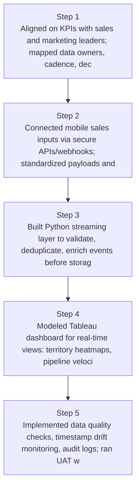
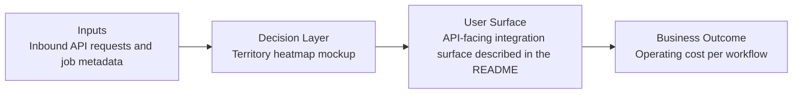
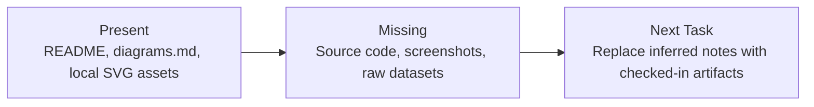

# Real-Time Sales Signal Dashboard Diagrams

Generated on 2026-04-26T04:29:37Z from README narrative plus project blueprint requirements.

## Streaming ingestion architecture

## Territory heatmap mockup

## Evidence Gap Map

